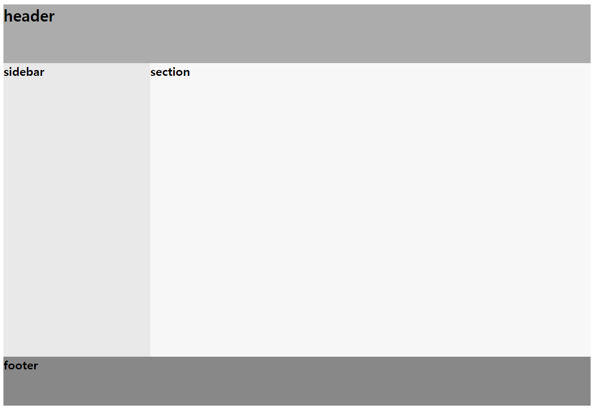

# HTML

# 구조

# 기본 구조

```html
<!DOCTYPE html>
<html lang="ko">
<head>
    <meta charset="UTF-8">
    <title>Document</title>
</head>
<body>
    
</body>
</html>
```

- <!DOCTYPE html>
    - 선언된 페이지의 HTML 버전이 무엇인지를 웹 브라우저에 알려주는 역할을 하는 선언문.
- <html>
    - HTML 문서의 루트(root) 요소를 정의
        - lang=”ko” : 문서의 언어를 한국어로 지정
- <head>
    - HTML 문서의 메타데이터(metadata)를 정의
        - 메타데이터(metadata)란 HTML 문서에 대한 정보(data)로 웹 브라우저에는 직접적으로 표현되지 않는 정보를 의미
        - 메타데이터는 <title>, <style>, <meta>, <link>, <script>, <base>태그 등을 이용해 표현 가능
- <title>
    - HTML 문서의 제목(title)을 정의
        - 웹 브라우저의 툴바(toolbar)에 표시되어 해당 웹 페이지의 제목이 된다.
- <body>
    - 웹 브라우저에서 보이는 내용(content) 부분
    

# 요소 구조

아니 근데 이렇게 기초부터 해야 해? 건너뜀.

# 태그

# 문서 구조 태그



| <header> | 헤더 영역 |
| --- | --- |
| <main> | 메인 영역 |
| <section> | 콘텐츠 영역 |
| <aside> | 사이드 바 영역 |
| <footer> | 푸터 영역 |
| <nav> | 내비게이션 영역. 문서 내 다른 위치, 다른 문서로 연결할 때 사용 |
| <article> | 독립적인 콘텐츠를 사용할 때 |
| <div> | 여러 소스 묶기 |

# 텍스트 태그

| <h1> ~ <h6> | 제목 |
| --- | --- |
| <p> | 단락 |
| <br> | 줄 바꿈, 종료 태그 X |
| <blockquote> | 인용문, 들여쓰기 적용 가능 |
| <strong> | 텍스트 굵게, 주로 중요 내용 |
| <b> | 텍스트 굵게, 단순 강조 표시 |
| <em> | 텍스트 기울임, 강조 |
| <i> | 텍스트 기울임, 단순 기울임 |
| <u> | 텍스트 밑줄 |
| <s> | 텍스트 취소선 |
| <abbr> | 줄임말 |
| <cite> | 참고 내용 |
| <code> | 소스 코드 |
| <small> | 작은 텍스트 |
| <sub> | 아래 첨자 |
| <sup> | 위 첨자 |
| <ins> | 공동작업문서에 새로운 내용 삽입 |
| <del> | 공동작업문서에 기존 내용 삭제 |

# 목록 태그

```html
<ol>
	<li> 항목 1 </li>
	<li> 항목 2 </li>
</ol>

<ul>
	<li> 항목 1 </li>
	<li> 항목 2 </li>
</ul>
```

- <ol> : 순서가 있는 목록
    - <ol type=?>
        - “1” : 숫자(기본값) 순서
        - “a” : 영문 소문자 순서
        - “A” : 영문 대문자 순서
        - “i” : 로마 숫자 소문자 순서
        - “I” : 로마 숫자 대문자 순서
    - <ol start=”3”>
        - 3부터 시작하는 인덱스
        
- <ul> : 순서가 없는 목록

# 설명 목록 태그

```html
<dl>
	<dt>이름</dt>
	<dd>설명</dd>
</dl>
```

- <dt> : 설명할 용어 (Term)
- <dd> : 설명할 내용 (Description)

# 표 태그

```html
<table>
  <tr>
    <td>1행 1열</td>
    <td>1행 2열</td>
  </tr>
  <tr>
    <td>2행 1열</td>
    <td>2행 2열</td>
  </tr>
</table>
```

- <caption> : 표 제목
- <tr> : 행 삽입
    - <td> : 셀 삽입
    - <th> : 셀 삽입 (진하게 표시)
- <thead> : 표 중 제목, 여러 페이지에 걸쳐 고정 가능
- <tbody> : 표 중 본문
- <tfoot> : 표 중 요약, 여러 페이지에 걸쳐 고정 가능

## <td>, <th>의 행/열 합치기 속성

- rowspan=”2” : 2개의 행 합치기
- colspan=”2” : 2개의 열 합치기
    
    합쳐진 셀들은 태그를 적지 않는다.
    

## 열의 스타일 속성 지정

- 열 1개만 지정할 땐, <col>
- 여러 열을 지정할 땐, <colgroup>

```html
<colgroup>
  <col>
</colgroup>
```
